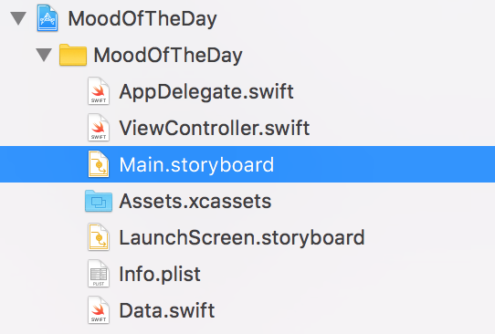
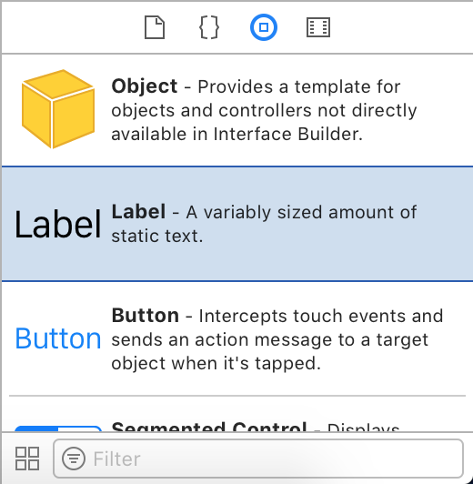
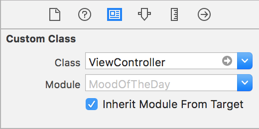

## Before You Start

Please download the latest version of Xcode (9.2) in order to have access to Swift 4. 

## Getting Started

1. Open Xcode and you should see a screen that looks like this:

   

2. Click on "Create a new Xcode project."

3. If not selected by default, click on "Single View App" and then click on "Next."

   

4. For "Product Name," put "MoodOfTheDay." You can change the title if you'd like and it won't affect the program, but this is the title we'll be using.

   Make sure you have "Use Core Data" **unchecked**. "Include Unit Tests" and "Include UI Tests" aren't going to be useful for this project, but you can leave them checked if you'd like.

   

## Adding Our Arrays

1. You're going to need one file before we start, and that is the (very long) Data.swift file included in this GitHub repo at the top of this page. [Link here](https://raw.githubusercontent.com/dustinnewman98/MoodOfTheDay/master/Data.swift)

   You can either copy-and-paste the file from this repo (which is what I'm going to do so you can see how to create a file and add it to your project), copy-and-paste from this [pastebin](https://pastebin.com/QPP8Dt9H) (https://pastebin.com/QPP8Dt9H), or download the Data.swift file from this repo.

2. Once you have that copied, go back to Xcode and create a new file.

   

3. Make sure "iOS" is selected at the top of the pop-up window and "Swift" is selected in the window and click "Next."

   

4. Name your new Swift file "Data" (the .swift extension will be added automatically, don't worry).

   

5. Drag the new Data.swift file under the folder "MoodOfTheDay". This isn't strictly necessary and will not affect functionality of the app, but it helps to keep things organized!

   At this point, your sidebar should look like this:

   

6. Time to copy-and-paste your data (or download directly from GitHub)! Don't worry if it pastes a little funny, there's just a lot of words to paste.

   Your Data.swift file (whether you copied or downloaded), should look like this:

   

## The Interface Builder

The Interface Builder is Xcode's WYSIWYG (what you see is what you get) editor for iOS apps and it is super helpful in quickly and visually designing your interfaces (i.e. screens).

### Setting Things Up

1. To see the Interface Builder, click on "Main.storyboard" in the sidebar

   

   A storyboard is a type of file that allows visual editing through the Interface Builder and each storyboard can have multiple screens if desired.

2. You should see something like this:

   

3. Now it's time to finally start building our app!

   Notice the little window in the lower right. This is where you find all the things you want to add to each storyboard.

   

4. Scroll down until you see "Label".

   

5. Now drag in "Label" and "Button" so you have something like this:

   

   Don't worry about where they're placed! We'll be setting up "constraints" right now to deal with that.

### Adding Constraints

"Constraints" are basically directions for Xcode to tell it where to place things in your app. For example, if something is stuck on the wall, you could say it's "constrained" to the wall.

1. With your "Label" element selected, click on the small box icon in the bottom right of the Interface Builder's main window:

   

2. You should get a pop-up that says "Add New Constraints." Modify it so it matches this:

   

   You'll need to modify the top constraint to 120, the left to 15, and the right to 15. All the others are unimportant.

   Now click "Add 3 Constraints."

3. Now, we're going to horizontally center our label. Navigate to the bar graph icon to the immediate left of the "add constraints" button we just used.

   

4. Add the "Horizontally in Container" constraint.

   

5. Add the following constraints to the "Button":

   

   That is, add a bottom constraint of 180 and horizontally center the button. The order they're added in does not matter! 

### Changing Attributes

This next section will take place in the "Attributes Inspector" of the right sidebar.

The icon looks like a pen tip and will the window it opens will look like this if you have the label selected.


1. Change the field that says "Label" (right under the dropdown menu where it says "Text: Plain") to say "The Mood Has Not Been Set!"

   You can put anything you like in the field, but you will see later why we have a message like this. But rest assured you can put anything there you would like without affecting anything.

   

2. Change the "Font" field to read "System 18.0" and have the "Style" set to Medium.

   

3. Change "Alignment" to be the center one and "Lines" to be 0.

   

4. So, right now, the "Attributes" pane for your label should match this:

   

   Now, time for the button!

5. The only thing for the button is to change the text to read "✨ Inspire Me ✨" (copy and paste this for easy emojis)

   

   And that's (almost) all we have to do in the Interface Builder! Congrats!

## Connecting the Code: IBOutlets

So, we have a sweet storyboard set up, but no actual code to *do* anything, yet.

For this next part, we're going to need a little tool called the "assistant editor." While still in Main.storyboard, click on the Venn diagram/intersecting circles icon near the upper right hand corner of Xcode.


which should bring up this very cluttered view:


To fix the clutter and make things a bit easier to work with, click the window pane-looking icon in the bottom toolbar that says "Hide Document Outline" when you hover over it.


And your new view should look like this now:


Much better! Now we're ready to connect our storyboard on the left pane to our actual code in the right pane.

1. While holding down the control key on your keyboard (between fn and option), hold down on the "Inspire Me" button and drag it over into the right pane.

   Note: Make sure that you do **not** drag the outlet inside any function! Drag it inside the class "ViewController".

   

2. When you release, a pop-up should appear with fields like "Connection," "Name", etc. and it should look like this:

   

3. Change the "Connection" to "Action" and then set the name to "inspireAction" and the Type to "UIButton".

   

4. Do the same thing for the label in the Interface Builder, naming its outlet "moodLabel".

   Your code in the right pane should look like this now:

   

5. And, with that, we're completely done with the Interface Builder!

## Writing the Code

Now it's time to write the code that will actually make our app do something: give us the mood of the day!

1. Close the assistant editor by clicking the paragraph-looking icon next to the Venn diagram in the upper right hand toolbar.

   

2. Use your left sidebar to navigate to your "ViewController.swift" file.

   

3. To get a random food from our m_foods array in Data.swift, we're going to use a builtin Swift function called arc4random_uniform (along with a bunch of ugly conversion code).

4. Paste the following code into your inspireAction() function:

   ```swift
   let foodNum = Int(arc4random_uniform(UInt32(m_foods.count-1)))

   let food = m_foods[foodNum]
   ```

5. Now, we need a way to get a random song from our m_songs array in Data.swift.

6. Paste the following, very similar code right below the code we just pasted (or above, it doesn't really matter as long as they are both inside the inspireAction function)

   ```swift
   let songNum = Int(arc4random_uniform(UInt32(m_songs.count-1)))

   let song = m_songs[songNum]
   ```

7. Now, let's put that code all together and generate the Mood of the Day!

8. Paste this last snippet of code below the existing code in inspireAction():

   ```swift
   moodLabel.text = "The Mood of Today is Dancing to \"\(song)\" and Eating \(food)"
   ```

9. Your inspireAction() function should now look like this:

   

10. Once last thing before we're done! Because of the way labels work in Swift, to deal with text overflow for the label ("moodLabel"), we need to add just one line of code inside the function viewDidLoad()

11. Underneath `super.viewDidLoad()` paste this line:

    ```swift
    moodLabel.numberOfLines = 0
    ```

12. Altogether now, your entire ViewController.swift file should look like this:

    

## Building and Running

Now that you have your finished app, it's time to run it!

Click on the "play" looking button in the upper left hand corner next to the "stop" looking button.


And that's it! This should run your very own app in the Simulator!

*Congratulations and I hope you reenact your Mood of the Day!*

## Documentation

While not necessary for the app to run, just in case you were wondering *how* exactly the code works, I thought it might be nice to have an explanation.

```swift
import UIKit

class ViewController: UIViewController {


	@IBOutlet weak var moodLabel: UILabel!


	@IBAction func inspireAction(_ sender: UIButton) {

		let foodNum = Int(arc4random_uniform(UInt32(m_foods.count-1)))

		let food = m_foods[foodNum]

		let songNum = Int(arc4random_uniform(UInt32(m_songs.count-1)))

		let song = m_songs[songNum]

		moodLabel.text = "The Mood of Today is Dancing to \"\(song)\" and Eating \(food)"

	}


	override func viewDidLoad() {

		super.viewDidLoad()

		// Do any additional setup after loading the view, typically from a nib.

		moodLabel.numberOfLines = 0

	}

	override func didReceiveMemoryWarning() {

		super.didReceiveMemoryWarning()

	// Dispose of any resources that can be recreated.

	}

}
```

So, let's walk through this line-by-line.

```swift
import UIKit
```

"UIKit" is Apple's framework for dealing with certain data types useful for apps, like labels or buttons or images. If you're familiar with C++, do you know how you can `#include <String>`? Well, this is a similar thing: we're using Apple's predefined classes of "UILabel," "UIButton," and more to make things *much* simpler on us.

```swift
class ViewController: UIViewController
```

This is creating a class called "ViewController" which *subclasses* from UIViewController (which is defined in UIKit). This means that our custom "ViewController" class inherits everything we need from UIViewController (conveniently defined by Apple), while still allowing us to add our own unique properties, like a "moodLabel" or "inspireAction()" function.

If you go back into the Interface Builder on Main.storyboard and click on the yellow circle on the top of the screen we've been developing on


and then navigate to the newspaper-looking icon on the right sidebar (the "Identity Inspector")



you can see that *this* is where we actually specify that our scene here is an object of our custom ViewController class. If you removed that specification, none of the code in ViewController.swift would apply to our app anymore.

```swift
@IBOutlet weak var moodLabel: UILabel!
```

An IBOutlet (Interface Builder Outlet) is basically a way of creating a variable and assigning it to a certain element on a storyboard. In this case, we created the variable "moodLabel" and assigned it to the label we put on our storyboard.

```swift
@IBAction func inspireAction(_ sender: UIButton)
```

An IBAction (Interface Builder Action) is a particular function associated with a certain element on the storyboard. Every time this element is tapped (or gestured to in whichever way you specified when you created the action), its associated IBAction function is called automatically behind the scenes. In this case, we created a function called "inspireAction" and associated it with the button we added on our storyboard. So, every time that button is clicked, this function is called/executed.

```swift
let foodNum = Int(arc4random_uniform(UInt32(m_foods.count-1)))

let food = m_foods[foodNum]
```

Ok, so here this syntax is admittedly pretty daunting looking but I promise it's not as scary as it seems. It might help to work from the "inside" of the function outward, so to speak, by which I mean let's first look at the line `m_foods.count-1`. This gets the number of elements in the m_foods array - Swift, unlike most lower-level languages, automatically stores an array's size as part of its data structure. - This gets the number of elements in the m_foods array and subtracts one from it. This is so we do not try to access the element after the last element by accident. 

However, `m_foods.count-1` returns a data type of "Int" (or "integer"). As you can see, we use the number `m_foods.count-1` as a parameter in the function `arc4random()`. This function expects another data type called "UInt32" which is… also an integer. But the data type "Int" in Swift can have negative values and very large values such as those over 2^(32). On the other hand, the data type "UInt32" can only have positive values and cannot go over 2^(32). Because our array is not anywhere even remotely near those sizes and is never going to have a "negative size," we can safely convert `m_foods.count-1` from Int to UInt32 for the `arc4random()` function.

Now, the `arc4random_uniform()` function is a builtin function in Swift that allows you to generate a random number from 0 all the way to whatever number you pass it. So, basically this line is saying "see how many things are in m_foods and get me a random number that is in that range."

```swift
let food = m_foods[foodNum]
```

This line is just saying "Hey, you know that random number we just got? The one that we know is somewhere in the range of our m_foods array? Yeah, access the actual food at that index/location."

The same thing happens with `m_songs`.

```swift
moodLabel.text = "The Mood of Today is Dancing to \"\(song)\" and Eating \(food)"
```

This is another example of "scary syntax, but simple idea." First, let's focus on the left side.

We know that moodLabel is our variable for the label we have in our storyboard. However, labels have many properties! They have fonts and colors and line numbers and many other things. So we can't just say

```swift
moodLabel = "The Mood of Today Is..."
```

We need to be a little more specific. So, that's why we say `moodLabel.text` because it lets the Swift compiler know "hey, we mean the actual text *inside* the label."

Now: the right side. Essentially, it's just a regular string. But the syntax may look a little weird, specifically all the backslashes.

First, `\(song)` is just Swift's way of denoting that "song" is actually a variable. Same thing with `\(food)`. If you just had "The Mood of Today is Dancing to song and Eating food" then it would just display exactly that, every time.

The other backslashes (in front of `\(song)`) are what's known as "escape characters." Escape characters are a way of telling the computer "I am about to use a symbol that you think is special, but I just want you to display it like a regular symbol." 

Specifically, the backslashes are our way of saying the string does not end at:

> The Mood of Today is Dancing To

But that we actuall y want the literal double-quotes inside our string, because that's what you use for song titles.

```swift
moodLabel.numberOfLines = 0
```

This is a slight workaround for how UILabels work. By default, if we did not have this, if the text of the label ever went off the screen, it would not wrap around. It would just break off and use ellipses (this is called truncation and it's very annoying/ugly).

However, if you set the number of lines for a UILabel to 0, it makes it wrap words! Go figure, right?

I hope you enjoyed this documentation and I hope it helps you in your next amazing Swift project!
